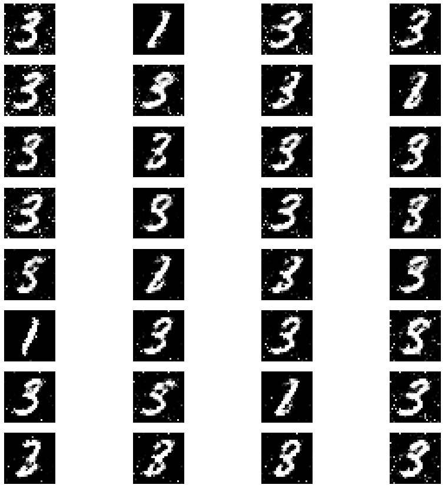

# Recreating Hand Written Number Using GAN

This Repository shows how to build a GAN network to create a hand written number to show how far AI could replicate humans tasks.

## Introduction

GAN model is a model consist of two Neural Models that works against each other, the two models are: A generator model to generate fake hand written number or AI attempt to create hand written number and the second one is a discriminator that tries to seperate which the real one and which isn't. the further those two models work against each other the better is the replication attempt since the generator model improve itself when its attempt get discovered. 

## Dataset

the mnist was used for this model that consist of image of hand written number in gray matter.

the data first got normalized to values between -1 to 1.

the generator will be generate hand written number using random vector with the shape of (batch,28*28).

## Methodology

1. the generator is consist of 4 Dense layers, 3 Batch normalizition layers and 1 input layer. the input layer takes input with the shape of (,28*28) then pass it to first dense layer which consist of 256 neurons with activation function of leakyrelu with alpha parameter as 0.2, the output of the pervious layer get passed to batch normalizition layer with momentum parameter value of 0.8. the 2nd dense layer take the result of batch normalization layer, which consist of 512 and activation function like the previous dense layer, then pass it to batch normalization layer that is similar to the prev batch layer. the 3rd dense layer is consist with 1024 neurons and with the same leaky relu function as its brothers then pass it to batch normalization layer like the previous one. the final dense layer consist of 28*28 neurons with tanh function that maps the values to -1 to 0.

2. the discriminator is consist of 3 dense layers and 1 input layer. the input layer takes input with the shape of (,28*28), the 1st dense layer which consist of 512 neurons and leakyrelu as its activation function takes the output and pass it to the next one. the 2nd dense layer consist of 256 neurons and with the same activation function take the output perform its functionality then pass it the final dense layer. the final layer consist of 1 neuron and sigmoid as its activation function so the output will be between 0 and 1 which represent fake or real respectively.

3. the combine model combine them both with disabling the discriminator trainability so the only the generator will change its weights.

4. finally the discriminator and the combine model get in a loop of 30000 step, where the discriminator get trained for discrimination between what's real and fake then the combine model tries to make it make a mistake in every step.

> [!NOTE]
> feel free to change the numbers of steps as you wish.

## Results

## Contributing

Contributions are welcome! Feel free to open issues or submit pull requests.

   
